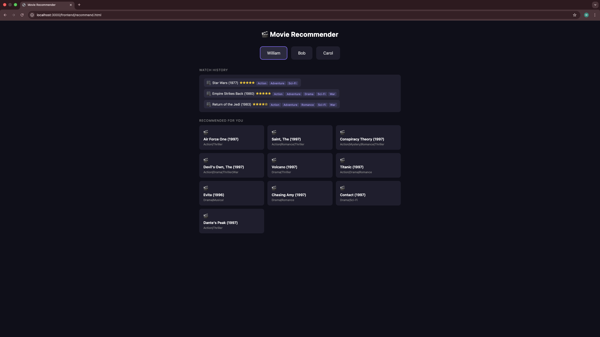

# movierec-two-towers

Retrieval-stage movie recommendation system using a Two-Tower model, trained on MovieLens 100K with implicit feedback and genre embeddings. Improved retrieval recall by 27% through systematic negative sampling and epoch tuning.

## Motivation

Building [AskUCI](https://github.com/ShengPeiWilliam/askuci) showed that pretrained embeddings can handle retrieval well on short, consistent text. But they can't adapt to a specific domain or learn from user behavior. I wanted to try training embeddings from scratch, and movie recommendation felt like the right starting point: well-defined domain, clean datasets, and a classic benchmark problem.

Reading Meta's post on [scaling Instagram Explore](https://engineering.fb.com/2023/08/09/ml-applications/scaling-instagram-explore-recommendations-system/) shaped the approach. Their two-stage pipeline splits the problem into retrieval (narrow millions down to hundreds) and ranking (re-rank with precision). This project focuses on the first stage using a Two-Tower architecture on MovieLens 100K.

## Design Decisions

### Why implicit feedback instead of ratings?

A natural first instinct is to train directly on star ratings. But rating values introduce subjective noise, a 3-star from one user might mean the same as a 5-star from another. More importantly, for a retrieval system, what matters most is whether a user is interested in a piece of content at all, not how precisely they'd score it.

So instead of regressing on ratings, we simplify to **implicit feedback**: watched = +1, not watched = -1. For each positive pair, 8 unseen items are sampled as negatives (ratio 1:8) to give the model enough contrast to learn meaningful separation.

## Architecture

Two separate neural networks learn representations for users and movies independently. After training, recommendations are made by finding movies whose learned vectors are closest to a given user's vector.

**User Tower** takes a `user_id` and learns a vector capturing that user's taste from watch history alone.

**Item Tower** takes a `movie_id` plus genre tags. Genre embeddings are mean-pooled and concatenated with the item embedding before passing through the network.

Both towers are trained jointly: watched pairs are pushed together, unmatched pairs are pushed apart. After training, movie vectors are pre-indexed in ChromaDB and served via a FastAPI endpoint.

## Demo

## Experiments

Evaluated using Recall@K on a held-out 20% test split per user. Recall@K measures what fraction of a user's held-out movies appear in the top-K recommendations.

Baseline: 100K dataset, no genre features, 20 epochs.

| Dataset | dim | neg | epoch | Genre | Recall@10 | Recall@20 | Recall@50 |
|---------|-----|-----|-------|-------|-----------|-----------|-----------|
| 100K | 128 | 4 | 20 | ✗ | 0.043 | 0.096 | 0.263 |
| 100K | 128 | 8 | 20 | ✗ | 0.070 | 0.151 | 0.336 |
| 100K | 128 | 8 | 20 | ✓ | 0.061 | 0.135 | 0.325 |
| 1M   | 128 | 8 | 20 | ✓ | 0.031 | 0.058 | 0.159 |
| **100K** | **128** | **8** | **50** | **✓** | **0.078** | **0.156** | **0.353** |

**Recall@50 = 0.353**: given 50 candidates, the model correctly includes 35% of what a user would actually watch, a reasonable net for a retrieval stage feeding into a downstream ranker.

Key findings:
- Doubling negative samples (1:4 to 1:8) gave the largest single improvement. More contrast in what a user *didn't* watch mattered far more than adding training data.
- Genre embedding showed no advantage at 20 epochs but surpassed the no-genre baseline at 50. The model needs enough training time to learn genre semantics on top of behavioral signals.
- Scaling from 100K to 1M didn't help. A larger item pool makes retrieval harder, and the same architecture without adjustment isn't enough to handle it.

## Reflections & Next Steps

Building this made clear where the real complexity lies in production recommendation systems, it's not the model architecture itself, but the signal quality, scale, and evaluation discipline around it.

If I were to continue:
- **Enrich the pipeline**: add user-side sequential features and a second-stage ranking model to improve both input quality and final precision.
- **Validate at scale**: offline Recall@K has limits. Testing on a larger dataset with A/B evaluation would be the only way to confirm real-world impact.

## References

- [Scaling the Instagram Explore Recommendations System, Meta Engineering (2023)](https://engineering.fb.com/2023/08/09/ml-applications/scaling-instagram-explore-recommendations-system/), motivation for the two-stage retrieval + ranking architecture.
- [MovieLens 100K Dataset, GroupLens](https://grouplens.org/datasets/movielens/100k/)
